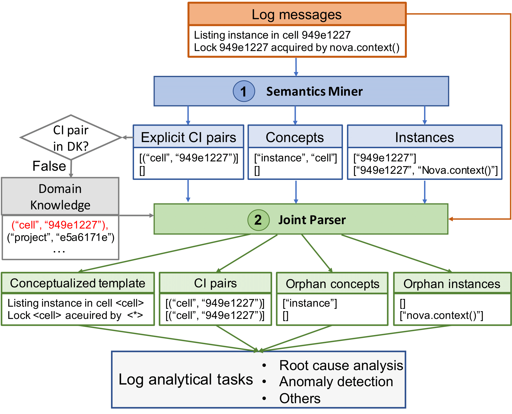

## SemParser Repository

This repository contains the main code and sampled results for **SemParser**. **SemParser** consists of two parts, i.e., semantics miner for mining explicit semantics from messages, and joint parser for discovering implicit semantics across different log messages.
The full code and data set will be released upon the acceptance.

## The content is organized as below:
- `main.py` shows the core part of proposed model.
- `data/annotated_log.v1.train` shows the base training data.
- Files under `data/predcitions` present the semantic parsing performance under seven representative systems.

