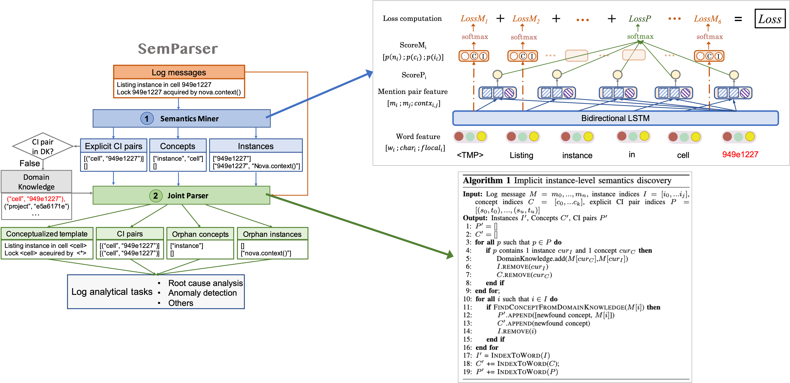
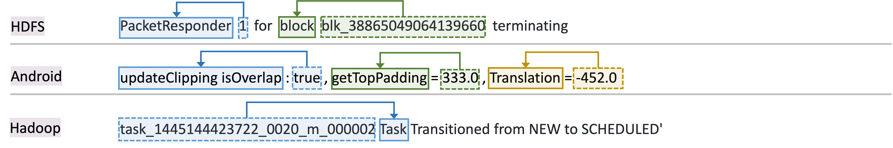

# SemParser

This is the repository of our ICSE'23 paper **SemParser: A Semantic Parser for Log Analysis**. We first introduce SemParser framework, then show the repository content organization, eventually present examples of acquired semantics in different system log messages.

## Introduction

SemParser is the first semantic-based parsing approach for log analysis, to overcome the syntax-based parser limitations on: (1) *inadequate attention to individual infor-mative tokens*; (2) *ignored semantics within a message*; and (3) *missing semantics between messages*. SemParser unlocks these bottlenecks in two components, a **semantics miner** for mining explicit semantics from messages, and a **joint parser** for discovering implicit semantics across different log messages. The overview framework is shown below.

## Contents

The content is organized as below:
- `main.py` shows the core part of proposed model.
- `data/annotated_log.v1.train` shows the base training data.
- Files under `data/predcitions` present the semantic parsing result under seven representative systems.

Full dataset and implementation code will be released upon paper acceptance.

## Sample outputs
We display sample log messages and their acquired semantics as follows:

