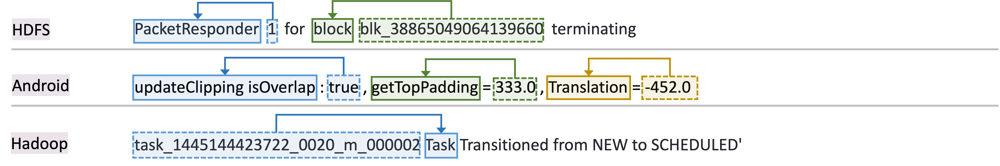

The folder shows semantics acquired from our approach.
Sample log messages and their acquired semantics are shown below, where concept, instance, and CI pair are highlighted by solid line box, dotted line box, and arrow (from instance to concept), respectively.

